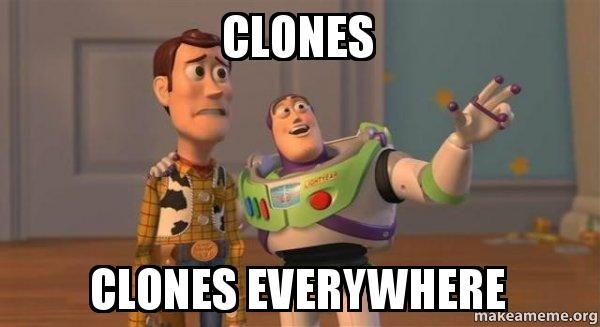

# CSS Cardio: Web Clones

> CSS Cardio projects are design focused monthly ventures where I write a clone of existing website from scratch using plain HTML, CSS and JS. You like the idea? Fork it, check it, add your stuff and have fun while doing it.

 

## Rules & Guidelines
- Goal is to recreate existing web site/app as close to the original as possible
- Focus is more on design, less on functionality
- Source code of original project can be looked only for:
  - Font family
  - Colors
- One clone per month can be considered as healthy CSS cardio routine 
- **When choosing technologies:**
  - CSS Libraries and frameworks should be avoided if possible
  - JS Frameworks and CSS preprocessors are welcomed to use and learn
  - It's good idea to decide on "tech stack" when planning clone project and force lesser known technologies to learn and reinforce them
    - Example: _I will only use CSS grid for layout and Sass for CSS._
  - Registered names, trademark images and original site assets should be avoided

 

- - -

## Clone Projects
* [CodePen Clone](clones/codepen-clone/)